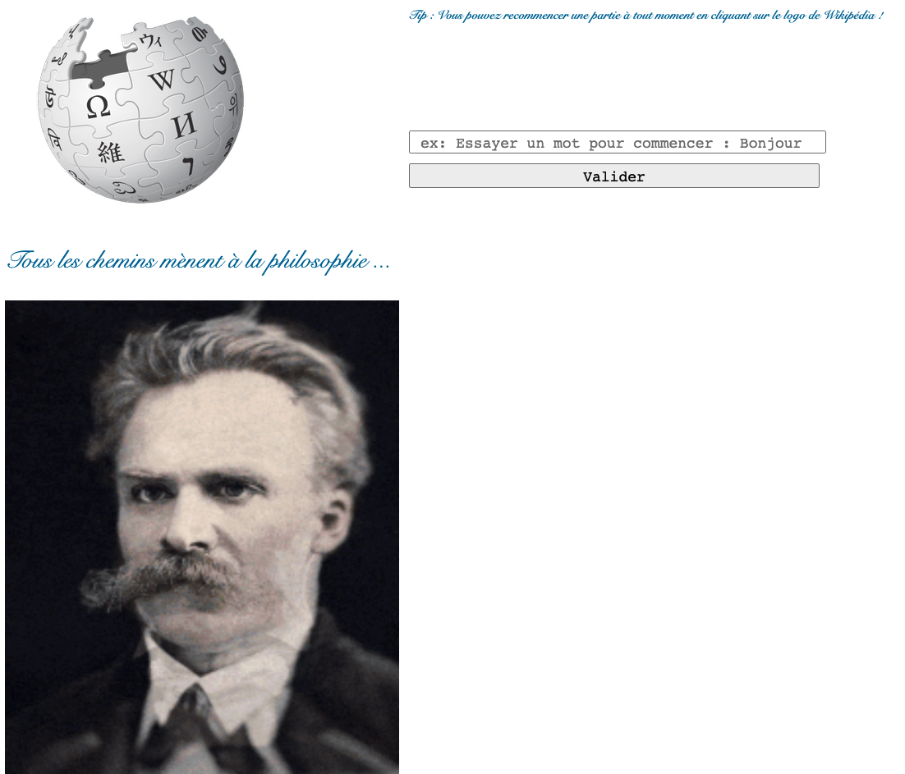
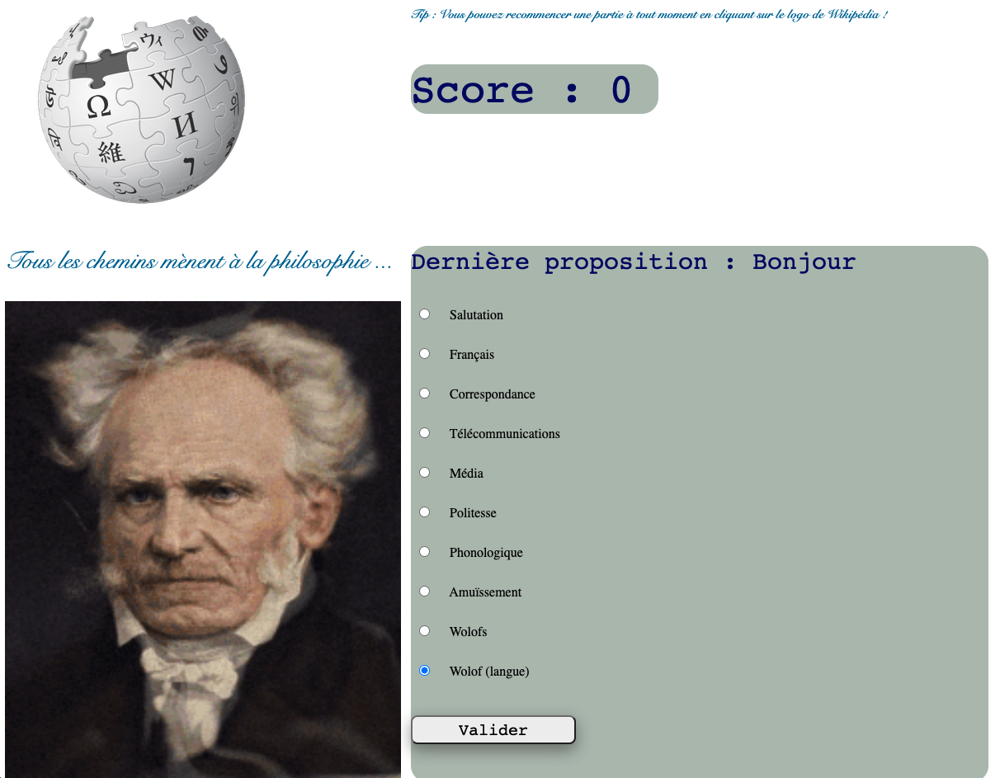
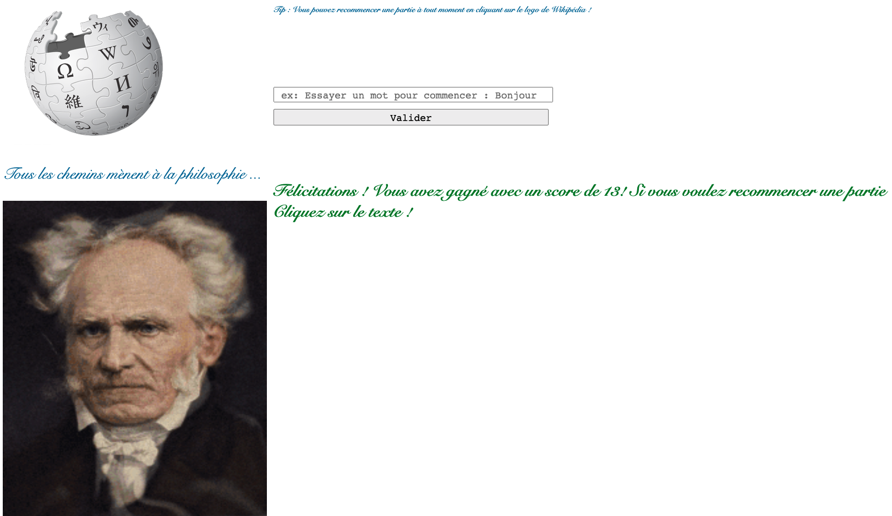

# Flask_philosophy
Project about Flask app game "Way to phylosophy"

It's a Web app based on Wikipedia webscrapping (Wiki API) to play the "Way of philosophy" game.
It's quite simple, this is the rule :

- start by running the **philosophy.py**
- write a first word that would give you the *'Philosophy'* page.
- now, keep playing and try to end the game.

Obviously you can't start with a word like philosophy or close

Just below, you have an example of Web app game :

